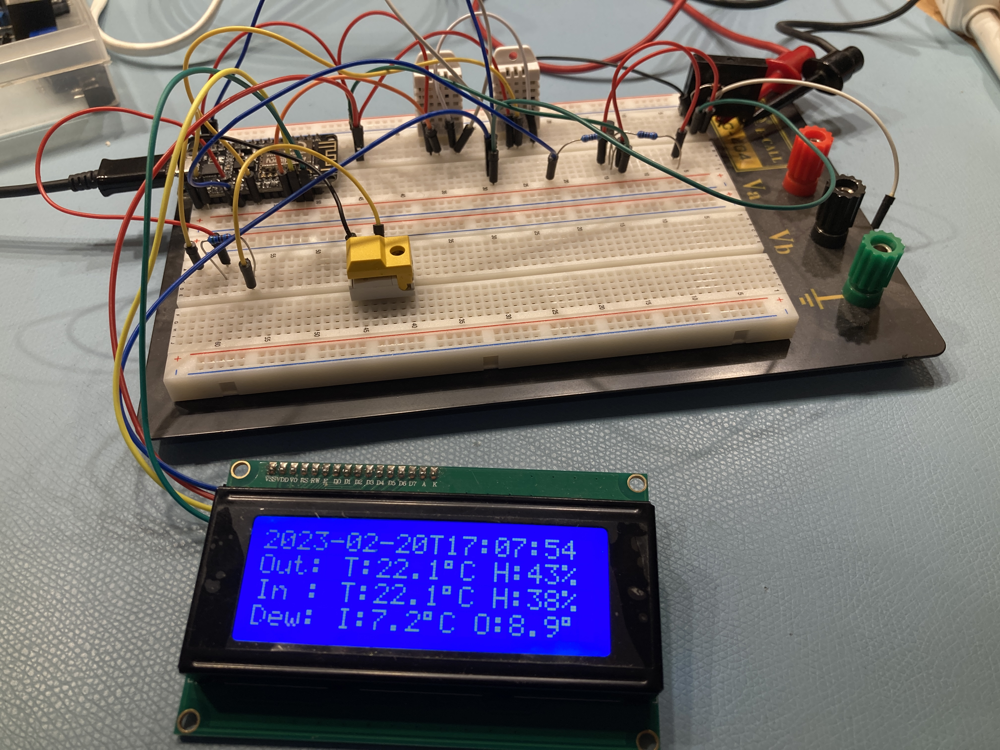
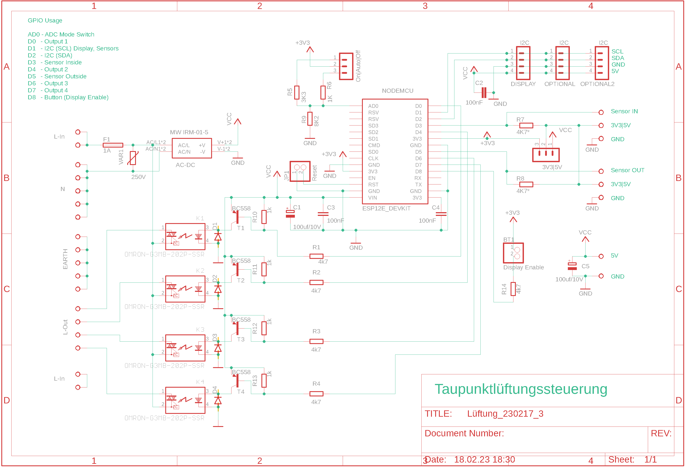
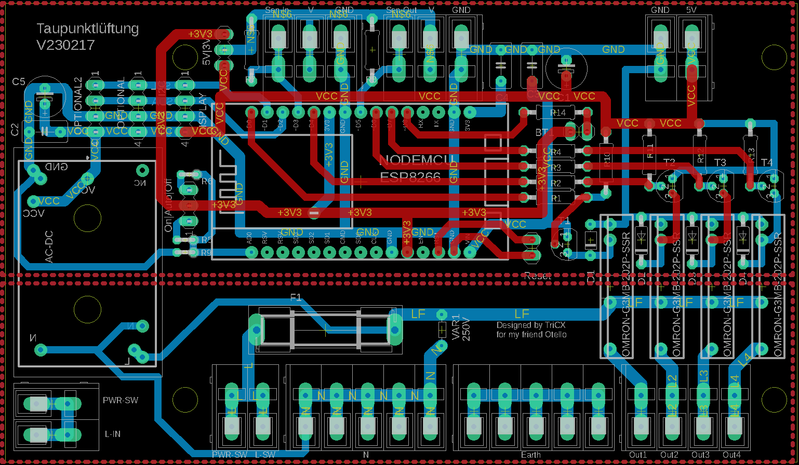
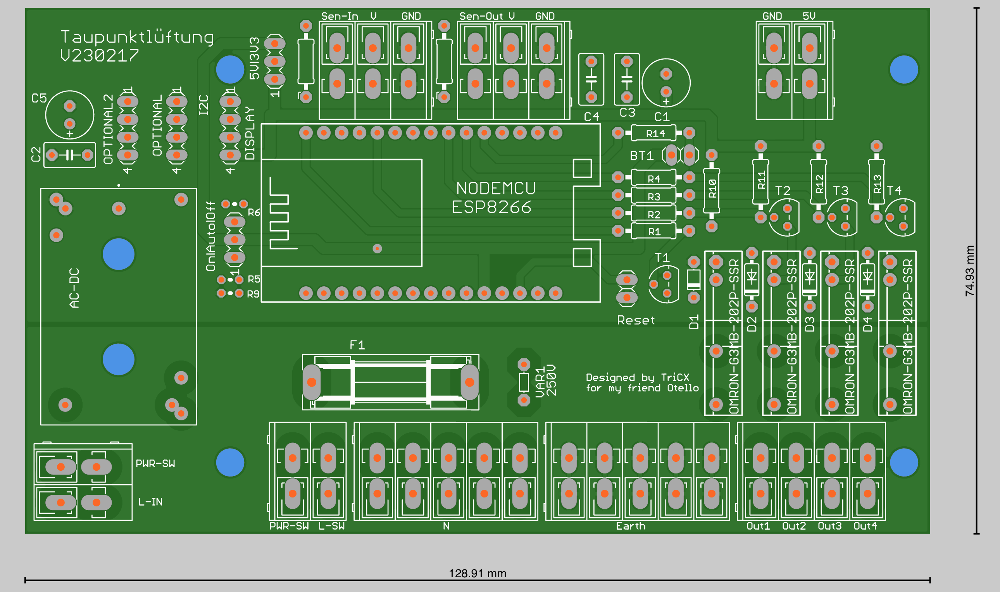

***

# Dew Point Ventilation

**Ventilation is the best and cheapest measure against damp cellars - at least if done right.
In this project, an ESP8266 (NodeMCU) monitors dew points from the inside and outside and activates up to 4 fans to transport the moisture in the air to the outside.**

This project is inspired by 2 articles by the German Make magazine: [Taupunktlüfter](https://github.com/MakeMagazinDE/Taupunktluefter) and [Zirkulationspumpensteuerung](https://github.com/MakeMagazinDE/Zirkulationspumpensteuerung)
Instead of their Arduino approach, this projects makes use of ESP8266 and [Tasmota](https://github.com/arendst/Tasmota).

**Note: I don't take over any risk, nor responsibility for anything. If you decide to reproduce this project you will be killed by hardware or software.**

A PCB was designed with Autodesk's Eagle. The PCB is currently under test, so be aware.

**Diffs from original designs by Make:**
- NodeMCUs instead of Arduino
- Tasmota and Script instead of Arduino coding
- 4 Outputs via solid state relais
- Multiple Sensor options:
- 1Wire
- I2C
- AM230x
